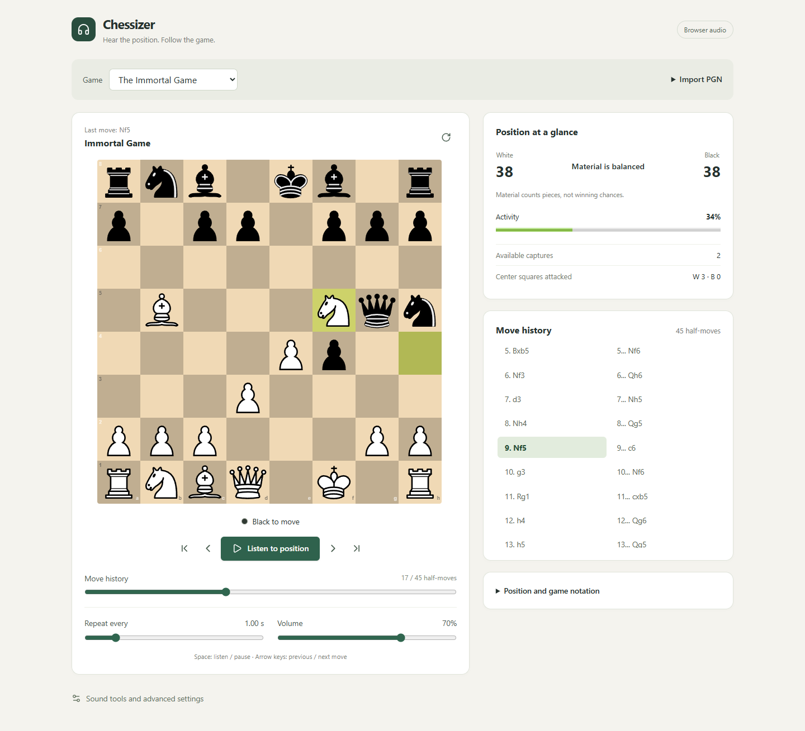

# Chessizer

Listen to a chess position, then move through the game to hear how it changes.

Chessizer is an experimental web app for chess sonification. It maps pieces, board locations, material balance and move events to sound. The goal is to make the relationship between White and Black easier to notice by ear while keeping the board and move history in view.

The main experience runs in the browser. An optional Python service can render a position as a layered WAV clip.



## What works today

- Import a PGN by pasting text, reading the clipboard or opening a file. Comments, headers and custom FEN starting positions are supported; the app follows the main line. Invalid imports leave the current game open.
- Explore the starting position, five historical games and a legal queen mate-in-one example.
- Navigate with the move list, timeline slider, first/previous/next/last controls or keyboard. One selected position drives the board, metrics and audio.
- Listen to the current position with Tone.js synthesis. Adjust volume and the repeat interval from 0.25 to 5 seconds, or change board traversal in advanced settings.
- Compare material, available captures and attacked center squares. Check and checkmate are identified. Capture sounds follow actual forward moves rather than treating timeline jumps as captures.
- Preview individual piece sounds, edit the active sound configuration and optionally play clips from the WAV service.

Listening repeats the selected position; it does not automatically advance the game. The activity meter is a descriptive combination of captures, center control and check, not a chess engine evaluation or a winning probability.

## Quick start

Use **Node.js 24.15 or newer within the 24.x line, or Node.js 26+**, and **pnpm 12.10.1**. The supported Node ranges and package-manager version are recorded in [package.json](package.json); [.node-version](.node-version) pins the development runtime.

```sh
git clone https://github.com/miikkij/chessizer.git
cd chessizer
pnpm install --frozen-lockfile
pnpm dev:frontend
```

Open [localhost:12173](http://localhost:12173). Choose a game and press **Listen to position** to enable browser audio. Python is not needed for this mode.

| Control | Action |
| --- | --- |
| Space | Listen to or pause the current position |
| Left / Right | Previous / next half-move |
| Home / End | First / last position |
| Timeline or move list | Jump to a position |
| Flip board | Switch the board orientation |

Text fields and sliders retain their normal keyboard behavior. Clipboard access depends on browser permission; pasting into the text field also works.

## Optional WAV service

Use **Python 3.12+**. Create the virtual environment at `soundAgentsv2/.venv`; the launcher uses that location.

On Windows, from the repository root:

```powershell
py -3.12 -m venv soundAgentsv2/.venv
.\soundAgentsv2\.venv\Scripts\python.exe -m pip install -r soundAgentsv2/requirements.txt
pnpm dev
```

Use an installed newer Python version in place of `-3.12` when appropriate. On macOS or Linux, with `python3` pointing to Python 3.12 or newer:

```sh
python3 -m venv soundAgentsv2/.venv
soundAgentsv2/.venv/bin/python -m pip install -r soundAgentsv2/requirements.txt
pnpm dev
```

`pnpm dev` starts both the frontend and WAV service. If the frontend is already running, use `pnpm wav:server` in another terminal instead. The service exposes [interactive API documentation](http://localhost:8001/docs) and a [health endpoint](http://localhost:8001/health).

In the app, open **Sound tools and advanced settings**, then **Play WAV**. WAV playback has separate volume, looping, playback-speed and sound settings. Starting browser synthesis stops WAV playback. Changing position stops the old clip; with WAV looping enabled, the new position is rendered and played.

## Development and verification

| Command | Purpose |
| --- | --- |
| `pnpm dev:frontend` | Start the browser app on port 12173 |
| `pnpm dev` | Start the browser app and configured local Python service |
| `pnpm wav:server` | Start only the Python WAV service |
| `pnpm test` | Run the TypeScript and React regression tests |
| `pnpm lint` | Check JavaScript and TypeScript with ESLint |
| `pnpm typecheck` | Type-check the application and tests |
| `pnpm build` | Type-check and build static files into `dist/` |
| `pnpm preview` | Serve the production build locally |

Before submitting a change, run:

```sh
pnpm test
pnpm lint
pnpm typecheck
pnpm build
```

The tests cover PGN parsing, navigation, shared board/audio state, sound scheduling, playback lifecycle and WAV request cancellation. React integration tests use JSDOM and mock audio hardware. They do not replace layout and listening checks in a real browser.

For WAV changes, activate the Python environment and run this from the repository root:

```sh
python -m unittest discover -s soundAgentsv2 -p test_semantics.py -v
```

These Python regressions render audio in memory without a running HTTP server. The optional HTTP smoke test, [test_service.py](soundAgentsv2/test_service.py), requires the service to be running and the extra dependencies in [requirements-dev.txt](soundAgentsv2/requirements-dev.txt).

The [CI workflow](.github/workflows/ci.yml) runs frontend checks on Linux and Windows, Python regressions, and a Docker smoke test. The separate [dependency audit](.github/workflows/dependency-audit.yml) checks installed dependencies weekly. [Dependabot](.github/dependabot.yml) proposes dependency updates for review; updates are not automatically merged.

### Dependency maintenance

```sh
pnpm audit
pnpm outdated
```

Review updates alongside their compatibility requirements, then rerun the checks above. TypeScript currently stays on 6.0.3 because the installed typescript-eslint 8.71 line supports TypeScript versions below 6.1. Revisit that choice when the [supported TypeScript range](https://typescript-eslint.io/users/dependency-versions/) changes.

pnpm's default [minimum release age](https://pnpm.io/supply-chain-security#delay-dependency-updates) can defer newly published versions for a day. A newer registry release may therefore appear in `pnpm outdated` before it is selected for installation.

### Static deployment and Docker

Serve the contents of `dist/` at the site root, including `configs/sound-agent-demo.json`. The [Dockerfile](Dockerfile) defines a frontend build and Nginx runtime. With Docker available:

```sh
pnpm docker:build
pnpm docker:run
```

The container serves the app at [localhost:8080](http://localhost:8080). It contains only the frontend. WAV playback needs a separately running service whose URL and allowed origins match the deployment.

## Architecture

The frontend uses React, TypeScript, Vite and Tailwind CSS. chess.js parses games and computes chess state; Chessground renders the controlled board; Tone.js supplies browser synthesis. The optional service uses FastAPI, python-chess and NumPy. Dependency requirements and resolved versions are maintained in [package.json](package.json), [pnpm-lock.yaml](pnpm-lock.yaml) and the [Python requirements](soundAgentsv2/requirements.txt).

| Area | Source |
| --- | --- |
| PGN parsing, FEN timeline and move metadata | [src/chess/game.ts](src/chess/game.ts) |
| Selected game, position and navigation | [src/hooks/useGameState.ts](src/hooks/useGameState.ts) |
| Material, center control and activity | [src/chess/metrics.ts](src/chess/metrics.ts) |
| Board and move list | [BoardView](src/components/BoardView.tsx), [MoveHistory](src/components/MoveHistory.tsx) |
| Browser audio and scheduling | [SoundAgent](src/audio/SoundAgent.ts), [NoteQueue](src/audio/NoteQueue.ts), [useSoundAgent](src/hooks/useSoundAgent.ts) |
| WAV requests and playback | [WavSoundPlayer](src/audio/WavSoundPlayer.tsx) |
| WAV generation and request models | [soundAgentsv2/main.py](soundAgentsv2/main.py) |
| Frontend regression tests | [tests](tests/) |

FEN retains the full position state, including side to move, castling rights and en passant information. Move metadata distinguishes a real forward move from loading, rewinding or seeking through a game.

The browser loads its active sound definition from [public/configs/sound-agent-demo.json](public/configs/sound-agent-demo.json). Its schema and shared validator live under [src/config](src/config/). Sample games are defined in [src/data/gamePresets.ts](src/data/gamePresets.ts). Inactive preset designs are preserved under [docs/archive/design-configs](docs/archive/design-configs/) and are not loaded by the application.

## Privacy and current limits

- PGN parsing, board navigation and Tone.js synthesis happen in the browser. Browser audio does not upload games.
- Audio preferences and configuration-editor drafts use local storage. The game itself is kept in the current session.
- WAV playback sends the selected FEN, audio configuration and, for a forward move, the previous FEN to the configured service. Its default address is `http://localhost:8001`; changing that address changes where those data are sent.
- The standalone WAV service has no authentication. Treat it as a development companion, not a ready-made public API.
- The JSON editor edits the active browser sound configuration. Drafts are validated and saved locally; use **Apply** to activate a valid draft. Saved drafts are not automatically restored as the active audio setup on reload.
- Random-position generation, generated near-mate endgames, the five named sound presets and the compact 256-character board format remain design goals. They are not implemented as selectable runtime features. There is no Stockfish analysis or browser audio export.

For current WAV setup, API behavior and supported settings, see the [WAV service guide](soundAgentsv2/README.md). A [historical WAV sample](examples/audio/README.md) is included for reference. Original specifications and dated analyses are indexed in the [project archive](docs/archive/README.md); they include planned behavior beyond the current app.

## License

The combined application is distributed under **GPL-3.0-or-later**. See [LICENSE](LICENSE) and [NOTICE.md](NOTICE.md). The [original MIT copyright and permission notice](LICENSES/MIT-original.txt) is preserved for the original code; dependencies retain their own licenses.

Production builds include the project notices and a generated `THIRD_PARTY_LICENSES.md` for bundled dependencies. Distributors must also provide recipients with the corresponding source for the exact build, including modifications and build instructions. A private repository link is not a substitute for source access.
